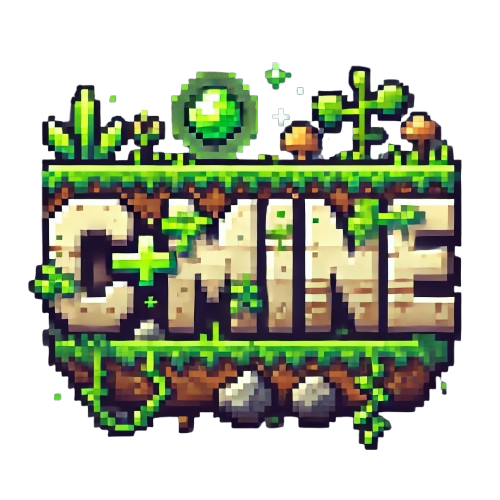
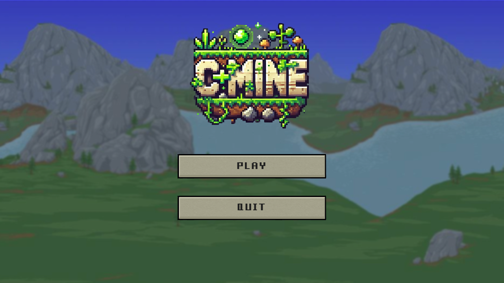

  

# Projeto Edoo CIN135: C+Mine
C+Mine é um jogo do gênero sandbox que gera um mundo aleatóriamente, permitindo exploração, mineração e interação com um ambiente dinâmico. O jogo é desenvolvido em C++ utilizando a biblioteca raylib para renderização gráfica e SimplexNoise para a geração de terreno procedural.

## Capturas de Tela

  
  
  

## Membros (Feito com muito amor por): 
* João Henrique S. Ebbers (jhse)
* Luiz Miguel G. Ramos de Andrade (lmgra)

## Características Principais:
* Geração de Mundo Aleatória: Utiliza ruído Simplex para criar terrenos dinâmicos.
* Sistema de Inventário: Gerenciamento de itens coletados e craftados pelo jogador.
* Deslocamento de Fundo (Parallax): Camadas de fundo que se movem de acordo com a posição do jogador, criando profundidade.
* Mundo Dinâmico: Permite manipulação dos blocos no ambiente, adicionando e removendo elementos.
* Interface Simples: Baseada em sprites pixelados para um visual retrô e minimalista.

## Características Principais:
* Linguagem: C++
* Bibliotecas: Raylib (Gráficos e Input) e SimplexNoise (Geração aleatória de mundo)

## Como Jogar
* Inicie o jogo e escolha o tamanho do mapa (Pequeno, Médio ou Grande).
* Navegue pelo mundo utilizando as teclas A e D.
* Pule com a tecla Espaço.
* Quebre blocos com o botão esquerdo do mouse.
* Coloque blocos com o botão direito do mouse, caso tenha itens no inventário.
* Gerencie seu inventário com as teclas 1 a 8 ou o scroll do mouse.

## Assets
Player Sprites - SunnyLand free 2d sprite collection, all credits to original asset creator at https://ansimuz.itch.io/sunny-land-pixel-game-art
