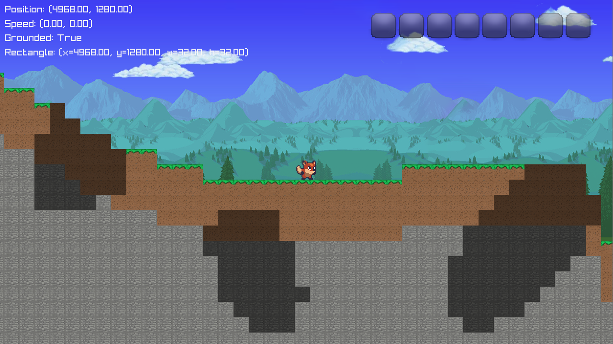
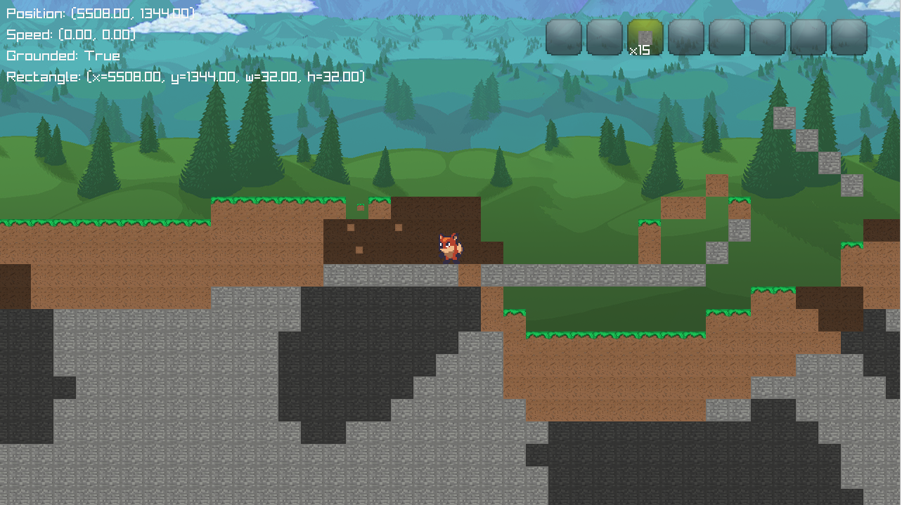

  

# Projeto Edoo CIN135: C+Mine
C+Mine é um jogo do gênero sandbox que gera um mundo aleatóriamente, permitindo exploração, mineração e interação com um ambiente dinâmico. O jogo é desenvolvido em C++ utilizando a biblioteca raylib para renderização gráfica e SimplexNoise para a geração de terreno.

## 🌐 GitHub Pages
[🔗 Acesse o site aqui](http://jshebb.github.io/Projeto_Edoo_CIN135/)

## Capturas de Tela

  
  
  

## Membros (feito com muito amor por): 
* João Henrique S. Ebbers __(jhse)__
* Luiz Miguel G. Ramos de Andrade __(lmgra)__

## Características Principais:
* __Geração de Mundo Aleatória:__ Utiliza Simplex para criar terrenos dinâmicos.
* __Sistema de Inventário:__ Gerenciamento de itens coletados e craftados pelo jogador.
* __Deslocamento de Fundo (Parallax):__ Camadas de fundo que se movem de acordo com a posição do jogador, criando profundidade.
* __Mundo Dinâmico:__ Permite manipulação dos blocos no ambiente, adicionando e removendo elementos.
* __Interface Simples:__ Baseada em sprites pixelados para um visual retrô e minimalista.

## Características Principais:
* Linguagem: __C++__
* Bibliotecas: __Raylib__ (Gráficos e Input) e __SimplexNoise__ (Geração aleatória de mundo)

## Como Jogar?
* __Inicie__ o jogo e __escolha o tamanho do mapa__ (Pequeno, Médio ou Grande).
* __Navegue__ pelo mundo utilizando as teclas __A__ e __D__.
* __Pule__ com a tecla __Espaço__.
* __Quebre blocos__ com o __botão esquerdo__ do mouse.
* __Coloque blocos__ com o __botão direito__ do mouse, caso tenha itens no inventário.
* __Gerencie seu inventário__ com as teclas __1 a 8__ ou o __scroll__ do mouse.

## Instalação:
Na aba Releases do repositório no GitHub, há um arquivo __.zip__ disponível para download. Basta acessar essa aba, baixar o arquivo, extrair o conteúdo e executar o jogo.

## Assets
Player Sprites - SunnyLand free 2d sprite collection, all credits to original asset creator at https://ansimuz.itch.io/sunny-land-pixel-game-art
